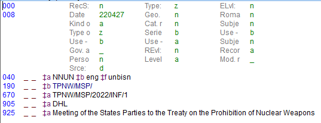
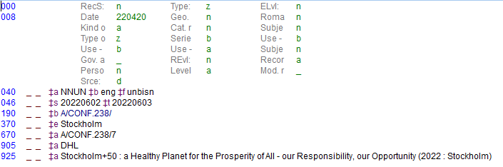
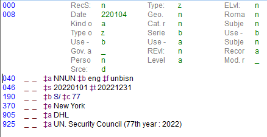
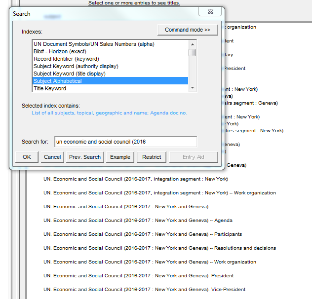

# 👍 Creating new series symbols

**Series Symbols**

Several changes have been made to series symbol creation recently; the manual is no longer up-to-date, but some of the basic information regarding series elements should still be consulted for reference: [http://www.un.org/depts/dhl/unbisref\_manual/docseries/docseries.htm](http://www.un.org/depts/dhl/unbisref\_manual/docseries/docseries.htm)

Series symbol records are created to provide access to UN documentation by authority-controlled series symbols. The series symbol is the root of the UN document symbol and represents the UN body to which a series of documents belongs; it may also represent a specific session or meeting of a UN body for which documents are issued, or a series of publications.

Symbols of United Nations documents are composed of capital letters combined with numerals, usually Arabic. When Roman numerals are used, they usually indicate the ordinal number of the session or of the subsidiary organ. The oblique stroke (/) is used to separate the components of the symbol.

New series symbols are usually created when the first document of a new body, session, meeting, conference, etc. is issued, and should be completed as per the instructions below:

New body:

040 $aNNUN$beng$funbisn => same for all

190 $bTPNW/MSP/ => series symbol

670 $aTPNW/MSP/2022/INF/1 => document based on which the series symbol was created

905 $aDHL => same for all

925 $aMeeting of the States Parties to the Treaty on the Prohibition of Nuclear Weapons => same as 610 in bib record (for agenda/work programme/report of the session)

New one-off conference:

046 $s20220602$t20220603 => beginning and end date of the meeting (yyyymmdd)

370 $eStockholm => place were conference is held

New session/year of an established body:

046 $s20220101$t20221231\*

190 $bS/$c77 => year/session is recorded in $c

\*If the session stretches over a whole year and/or no specific beginning/end dates are specified, use the following format:

046 $syyyy0101$tyyyy1231

For years/sessions, follow the patterns of previous series symbols, for example:

190 $bE/CN.6/$c66 => for the 66th session of the Commission on the Status of Women

190 $bA/CN.10/$c2022 => for the 2022 sessions of the Disarmament Commission

For retrospective press releases, follow this pattern:

040 $aNNUN$beng$funbisn => same for all

190 $bST/DPI/PRESS/TA/ => series symbol

670 $aSG/238 => document based on which the series symbol was created

905 $aDHL => same for all

925 $aUN. Department of Public Information => same for all

975 $aSecretariat. Department of Public Information. Press release. Technical Assistance => in red, same for all; last part derived from content (TA = Technical assistance)

How to look up authority for 925 – copy from previous year/session and search in Subject Alphabetical with new year/session (results will be in alphabetical and chronological order so you can easily see if the year/session exists already):

If no authority is available yet for session/year in question, flag to Viola.
